# Telegram AI Chat Bot - Class Diagram

This document contains the class diagram for the Telegram AI Chat Bot project, showing the architecture and relationships between components.

## Class Diagram

```mermaid
classDiagram
    %% ========================================
    %% Main Entry Point
    %% ========================================
    class Main {
        +main() async
    }

    %% ========================================
    %% Bot Handler Layer
    %% ========================================
    class BotHandler {
        -logger: Logger
        -bot: AsyncTeleBot
        -handler_registry: HandlerRegistry
        +__init__()
        -_setup_bot_logging()
        -_register_handlers()
        +start_polling() async
        +list_articles(user_id: int) async
        +read_article(user_id: int, article_id: int) async
        +mark_progress(user_id: int, article_id: int, position: int) async
    }

    class HandlerRegistry {
        -bot: AsyncTeleBot
        -logger: Logger
        -logged_message_handler
        +__init__(bot, logger)
        -_create_logged_message_handler()
        +register_all_handlers()
        -_register_welcome_handler()
        -_register_rules_handler()
        -_register_echo_handler()
        -__save_user(message, session) async
    }

    %% ========================================
    %% Telegraph & Channel Management
    %% ========================================
    class TelegraphManager {
        -TOKEN_FILE: str
        -telegraph: Telegraph
        -access_token: str
        -short_name: str
        -author_name: str
        -author_url: str
        +__init__(access_token: str)
        -__setup_telegraph()
        +create_article(article: Article) async List~str~
        +split_content(content: str, title: str, reserve_space_for_nav: bool) List~str~
        -_estimate_chunks_count(content: str, title: str) int
        -_add_navigation_links(urls: List[str], chunks: List[str], title: str) async
        -_add_reposting_date(content: str) str
    }

    class ChannelPoster {
        -bot
        -channel_id: int
        +__init__(bot_instance, channel_id: int)
        +post_article(telegraph_urls: List[str]) async
    }

    %% ========================================
    %% Orchestration Layer
    %% ========================================
    class ReviewOrchestrator {
        -scraper: ReviewScraper
        -telegraph: TelegraphManager
        -db: AsyncSession
        -bot: BotHandler
        -channel: ChannelPoster
        +__init__(review_scraper, telegraph_manager, db_session, bot_handler, channel_poster)
        +process_review_batch() async Review
        +process_articles(raw_review_data: Dict) async List~Article~
        +process_single_article(article: Article) async Article
        -_create_articles(raw_review_data: Dict) List~Article~
    }

    %% ========================================
    %% Scraping Layer - Abstract Classes
    %% ========================================
    class Scraper {
        <<abstract>>
        +get_listing_urls()* List~str~
        +scrape_single_article(article_url: str)* Dict
        +scrape_review_batch()* Dict
        +validate_content_data(content_data: Dict) bool
        +handle_scraping_error(error: Exception, context: str)
    }

    class Fetcher {
        -base_url: str
        -session: Session
        +__init__(base_url: str)
        +fetch_page(url: str) str
        +fetch_multiple_pages(urls: List[str]) Dict~str, str~
        +validate_url(url: str) bool
        +handle_request_error(error: Exception, url: str)
    }

    class Parser {
        <<abstract>>
        +parse_listing_page(html: str)* List~str~
        +parse_content_page(html: str, url: str)* Dict
        +extract_title(soup: BeautifulSoup)* str
        +extract_content(soup: BeautifulSoup)* str
        +extract_metadata(soup: BeautifulSoup)* Dict
        +clean_content_for_publishing(content_div)* str
        +create_soup(html: str) BeautifulSoup
        +normalize_url(url: str, base_url: str) str
        +clean_text(text: str) str
    }

    %% ========================================
    %% Scraping Layer - Concrete Implementations
    %% ========================================
    class ReviewScraper {
        -base_url: str
        -fetcher: Fetcher
        -parser: ReviewParser
        +__init__(base_url: str)
        +get_listing_urls() List~str~
        +get_content_data(article_url: str) Dict
        +get_review_id() int
        +scrape_single_article(article_url: str) Dict
        +scrape_review_batch() Dict
    }

    class Fetcher {
        -base_url: str
        -session: Session
        +__init__(base_url: str)
        +fetch_page(url: str) str
        +fetch_multiple_pages(urls: List[str]) Dict~str, str~
        +validate_url(url: str) bool
        +handle_request_error(error: Exception, url: str)
    }

    class ReviewParser {
        -base_url: str
        +__init__(base_url: str)
        +parse_listing_page(html: str) List~str~
        +extract_link(link) str
        +parse_content_page(html: str, url: str) Dict
        +extract_metadata(soup: BeautifulSoup) Dict
        +extract_review_id(html: str) int
        +extract_title(soup: BeautifulSoup) str
        +extract_content(soup: BeautifulSoup) str
        +clean_content_for_publishing(content_div) str
        -_extract_authors(soup: BeautifulSoup) List~str~
        -_extract_date(soup: BeautifulSoup) str
    }

    %% ========================================
    %% Database Layer
    %% ========================================
    class DatabaseManager {
        <<singleton>>
        -_instance: DatabaseManager
        -_initialized: bool
        -sync_engine: Engine
        -async_engine: AsyncEngine
        -SyncSessionLocal: sessionmaker
        -AsyncSessionLocal: async_sessionmaker
        +__new__(cls)
        +__init__()
        -_setup_engines()
        -_setup_session_factories()
        +get_async_session() AsyncContextManager
        +get_sync_session() ContextManager
        +create_all_tables() async
        +drop_all_tables() async
    }

    %% ========================================
    %% Database Models
    %% ========================================
    class User {
        <<SQLModel>>
        +telegram_id: int [PK]
        +username: str
        +first_name: str
        +last_name: str
        +phone: str
        +is_admin: bool
        +registered_at: datetime
    }

    class Article {
        <<SQLModel>>
        +id: int [PK]
        +title: str
        +content: str
        +original_url: str
        +review_id: int [FK]
        +telegraph_urls: List~str~
        +created_at: datetime
        +authors: List~str~
        +review: Review
    }

    class Review {
        <<SQLModel>>
        +id: int [PK]
        +source_url: str
        +created_at: datetime
        +articles: List~Article~
    }

    %% ========================================
    %% External Libraries
    %% ========================================
    class AsyncTeleBot {
        <<external>>
        +polling()
        +reply_to()
        +message_handler()
    }

    class Telegraph {
        <<external>>
        +create_account()
        +create_page()
        +edit_page()
    }

    class BeautifulSoup {
        <<external>>
        +select()
        +find()
        +get_text()
    }

    %% ========================================
    %% Relationships
    %% ========================================

    %% Main Entry Point
    Main --> BotHandler : creates

    %% Bot Handler Relationships
    BotHandler --> HandlerRegistry : creates
    BotHandler --> AsyncTeleBot : uses
    HandlerRegistry --> AsyncTeleBot : registers handlers
    HandlerRegistry --> User : saves to DB

    %% Orchestration Relationships
    ReviewOrchestrator --> ReviewScraper : uses
    ReviewOrchestrator --> TelegraphManager : uses
    ReviewOrchestrator --> BotHandler : uses
    ReviewOrchestrator --> ChannelPoster : uses
    ReviewOrchestrator --> Article : creates
    ReviewOrchestrator --> Review : creates
    ReviewOrchestrator --> DatabaseManager : uses session

    %% Telegraph & Channel
    TelegraphManager --> Telegraph : uses
    TelegraphManager --> Article : processes
    ChannelPoster --> AsyncTeleBot : uses

    %% Scraping Hierarchy
    Scraper <|-- ReviewScraper : implements
    Parser <|-- ReviewParser : implements

    ReviewScraper --> Fetcher : uses
    ReviewScraper --> ReviewParser : uses
    ReviewParser --> BeautifulSoup : uses
    Fetcher --> BeautifulSoup : returns HTML for

    %% Database Relationships
    DatabaseManager --> User : manages
    DatabaseManager --> Article : manages
    DatabaseManager --> Review : manages
    Review "1" --> "*" Article : contains
    Article --> Review : belongs to

    %% Handler to Database
    BotHandler --> DatabaseManager : uses session
```

## Component Descriptions

### Main Entry Point

- **Main**: Application entry point that initializes and starts the bot

### Bot Handler Layer

- **BotHandler**: Main bot controller, manages bot lifecycle and handlers
- **HandlerRegistry**: Registers and manages message handlers with logging

### Telegraph & Channel Management

- **TelegraphManager**: Creates and manages Telegraph articles, handles content splitting
- **ChannelPoster**: Posts articles to Telegram channels

### Orchestration Layer
- **ReviewOrchestrator**: Orchestrates the full workflow: scraping → Telegraph → database → posting

### Scraping Layer

#### Abstract Base Classes

- **Scraper**: Abstract base for scraping workflows
- **Parser**: Abstract base for HTML parsing

#### Concrete Implementations

- **ReviewScraper**: Scrapes review articles from websites
- **Fetcher**: Fetches HTML content via HTTP
- **ReviewParser**: Parses HTML to extract structured data

### Database Layer

- **DatabaseManager**: Singleton managing database connections and sessions
- **User**: User data model
- **Article**: Article data model with Telegraph URLs
- **Review**: Review data model containing multiple articles

## Key Design Patterns

1. **Singleton Pattern**: DatabaseManager ensures single instance
2. **Abstract Factory**: Scraper and Parser provide abstract interfaces
3. **Decorator Pattern**: HandlerRegistry wraps handlers with logging
4. **Orchestrator Pattern**: ReviewOrchestrator coordinates complex workflows
5. **Repository Pattern**: DatabaseManager abstracts data access

## Data Flow

<<<<<<< Updated upstream
1. **Scraping Flow**: ReviewScraper → ReviewFetcher → ReviewParser → Raw Data
2. **Processing Flow**: ReviewOrchestrator → TelegraphManager → Article with URLs
3. **Storage Flow**: Article/Review → DatabaseManager → Database
4. **Posting Flow**: ChannelPoster → AsyncTeleBot → Telegram Channel
5. **User Interaction**: AsyncTeleBot → HandlerRegistry → BotHandler → User saved to DB
